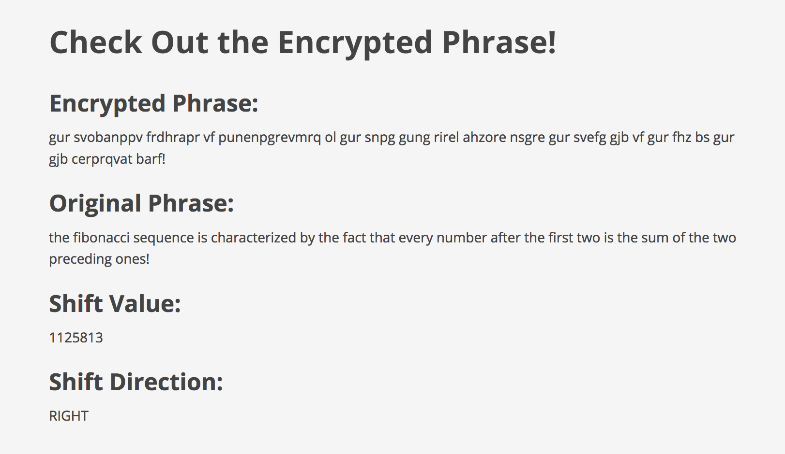

# drupal-crytography

#### A custom module which encrypts user input using a Caesar cipher, also known as Caesar's cipher, the shift cipher, Caesar's code, or Caesar shift. 12.09.2016

#### By [Lisa MacCarrigan](https://github.com/lisamaccarrigan)

## Description

This is a simple web app for users to try out a custom module which encrypts user input using a Caesar Cipher. This is a type of substitution cipher in which each letter in the plaintext is replaced by a letter some fixed number of positions (either right or left) down the alphabet. Any spaces or punctuation in the input phrase are ignored and reproduced in the final result without being shifted.

## Specifications:
| _Behavior_ | _Input Shift Value_ |  _Input Shift Direction_ | _Input Phrase_ | _Encrypted Output_ |
|:---------------------------------------------------------------------:|:---------------------------------------------------------------------:|:---------------------------------------------------------------------:|:---------------------------------------------------------------------------:|:-------------------------------------------------------------------------------------------------------------------:|
| Shift right | 1 | right | a | b |
| Shift left | 1 | left | b | a |
| Shift right with wrap-around | 1 | right | z | a |
| Shift left with wrap-around | 1 | left | a | z |
| Shift right 'through' alphabet one or more times | 55 | right | a | d |
| Shift left 'through' alphabet one or more times | 55 | left | a | x |
| Enter multi-word phrase with punctuation | 25 | right | E.T. phone home. | d.s. ognmd gnld. |

## Setup/Installation Requirements

If editing:
* Clone this repository: https://github.com/LisaMacCarrigan/drupal-crytography.git
* OPEN project folder ('drupal-crytography') in Code Editor of choice

Install and Configure PHP development environment - Please visit http://goo.gl/JDBJ0p for easy-to-follow instructions by Epicodus. In general, you will need to:
* Download and Install 'MAMP' by visiting: https://www.mamp.info/en/downloads/.
* In MAMP, set Document Root to project folder, then Start Server and visit http://localhost:8888/phpMyAdmin/.
* Import /drupal-cryptography/sites/db-backup/**cipher.sql.zip** into phpMyAdmin.
* Launch http://localhost:8888/ and enjoy!

## Known Bugs

No known bugs.

## Support and contact details

For comments or questions, please email Lisa.MacCarrigan@gmail.com

## Technologies Used

* PHP
* MAMP Version 4.0.6
* MySQL Server
* phpMyAdmin Version 4.6.4
* Drupal 7.52

### License

*This application is licensed under the MIT license*

Copyright (c) 2016 [Lisa MacCarrigan](https://github.com/lisamaccarrigan)
